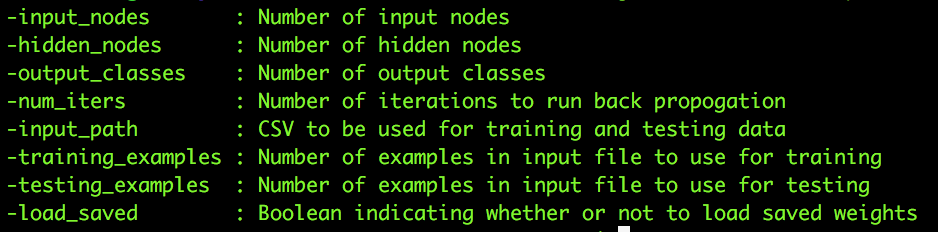

#Nerual-Network


<p align="left">
This project contains a neural network written in java to be used for classification tasks. It takes as input a comma delimited file and then learns to accurately classify the data using the backpropogation algorithm. For testing purposes, we used the popular MNIST dataset. This dataset contains handwritten digits with values between 0 and 9. In order to fit the project on github and decrease testing time, we only perform classification on the digits 0,1, and 2. However, any number of output classes can be used. Finally, we added a utility for visualizing the digits that are incorrectly classified.
</p>

<br>
#Project Structure

```
   src-|
       -NeuralNet.class --> Compiled NeuralNet code
       -NeuralNet.java  --> Code containing neural network logic
       -csvToImage.py   --> Converts incorrectly classified examples into png files for examination
   lib-|
       -012mnist.csv    --> Default dataset for training the neural network
       -erros.csv       --> Incorrectly classified data from the testing set written by the NeuralNet class
       -weights.csv     --> Saved model weights
       -images-|
               -i##_p#.0_a#.0.png  --> Incorrectly classified examples as images. 
                                       |-> Created by csvToImage.py. 
                                       |-> p#.0 signifies the class predicted. 
                                       |-> a#.0 signifies the true class.
```

#How To Use
To use the basic network funcationality for classificiation tasks:
1. Clone the repository.
2. Navigate to the src directory: ```cd src  ```.
3. Enter: ```  java NeuralNet  ```
This will produce a trained model and return an accuracy on the 012mnist.csv file. All of the errors and the corresponding predictions and correct answers will be written to errors.csv under the lib directory.

####Advanced Usage
If you wish to use another dataset or alter other parameters there are command line arugments for doing so.

* To access the help menu: 
 * ``` java NeuralNet -help ```
 * </img>
* Example of using command line parameters:
 * ``` java NeuralNet -num_iters 200 -hidden_nodes  ```  
* Using a different dataset:
 * You have to make sure the structure of the csv is the following:
  * Each row is a single example
  * The last column contains the output class number
 * You have to set the proper number of output classes and the new csv path
  * ``` java NeuralNet -output_classes [number of classes] -input_path [path to csv] ```
 

######Converting Examples of Errors Into Images:
Once you have run the neural network, there will be a file generated called errors.csv under the lib directory.
If you want to turn these into png's, then issue the following command:
* ```python3 csvToImage.py ```

####Sample Errors
* The model achieve ~95% accuracy. Below are some of the incorrect predictions.
<table border="0.5">
<tr>
<td>Pred: 0 | Actual: 2</td>
<td>Pred: 2 | Actual: 1</td>
<td>Pred: 0 | Actual: 2</td>
<td>Pred: 2 | Actual: 1</td>
<td>Pred: 0 | Actual: 2</td>
</tr>
<tr>
<td></td>
<td></td>
<td></td>
<td></td>
<td></td>
</tr>

</table>
